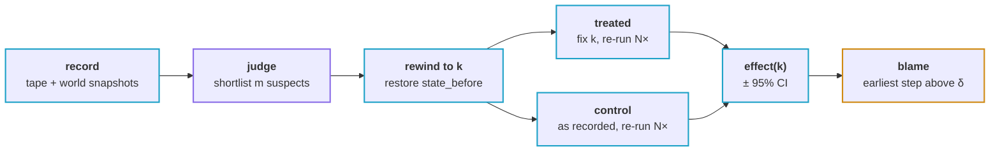
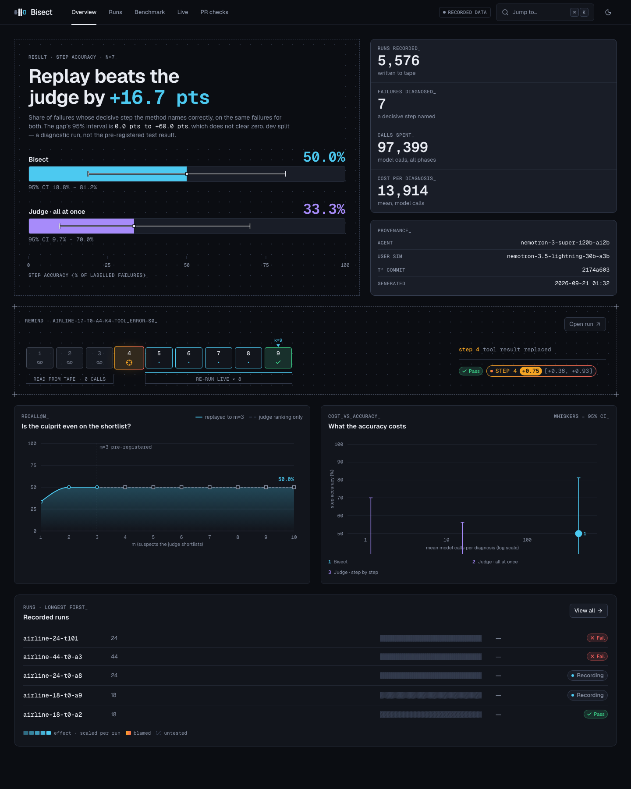
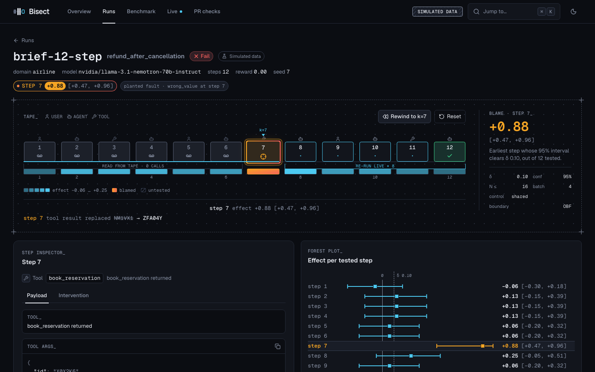
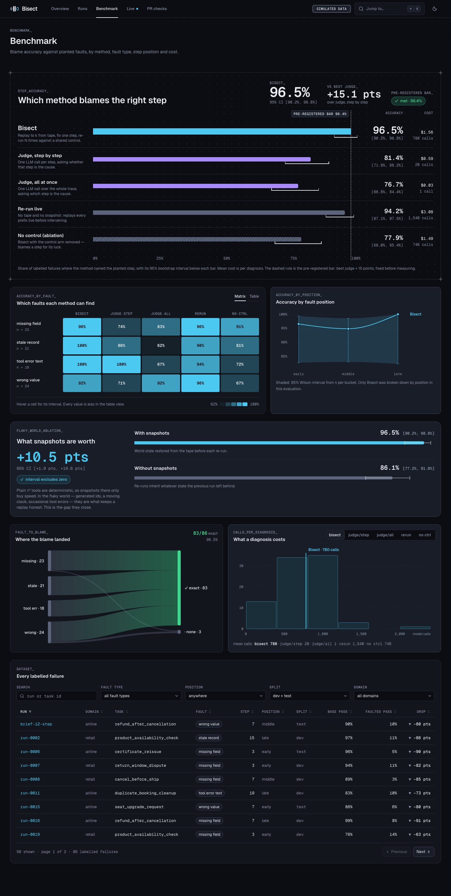
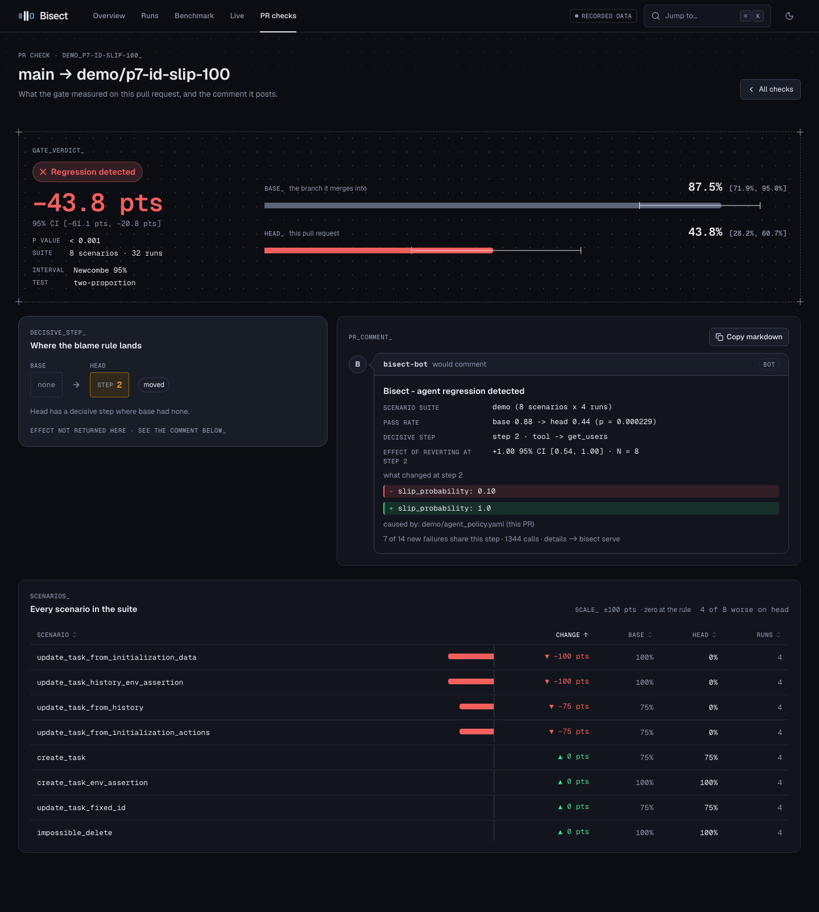

<div align="center">

<picture>
  <source media="(prefers-color-scheme: dark)" srcset="docs/assets/hero.svg">
  <source media="(prefers-color-scheme: light)" srcset="docs/assets/hero-light.svg">
  
</picture>

**`git bisect`, for agent runs.** Rewind a failed run to step *k*, change exactly one thing,
re-run the rest *N* times, and measure which step actually caused the failure.

<p>
  
  
  
  
  
</p>

<sub>[how it works](#how-it-works) · [dashboard](#the-dashboard) · [quickstart](#quickstart) · [pr check](#the-pr-check) · [results](#results)</sub>

</div>

<br>

When an agent run fails, something has to say *which step broke it*. Today that is usually an
LLM judge reading the transcript and picking a step it finds suspicious. Bisect does not ask.
It puts the step back on the table and tests it.

> Bisect is under active construction — the recorder, replay engine, estimator and dashboard
> are in place; the evaluation against the judge baselines is still running.

### what it is

- **A recorder.** Every step of a run is written to an append-only tape: the exact model
  request, the tool call, and a snapshot of the world before and after. Replay is byte-identical
  and makes zero network calls; a divergence is an error, never a silent live fallback.
- **A counterfactual engine.** Restore the world at step *k*, apply exactly one intervention —
  a replaced tool result, a forced action, a fresh sample, an edited prompt, a swapped model —
  and let the rest of the run happen live.
- **An estimator with an interval.** Treated and control arms, Wilson per arm, Newcombe 95% CI
  on the difference. No estimate is ever shown without its interval.

### how it works



```
effect(k) = P(pass | fix k) − P(pass | recorded k)
```

The judge narrows the search; replay decides. Blame goes to the **earliest** step whose CI lower
bound clears δ — not the largest effect, because a later fix can partially recover a run that was
already lost. Without the control arm you would blame a step for luck.

### the dashboard

`bisect serve` opens a local dashboard at `127.0.0.1:8484` — the tape, the rewind, the forest
plot, the benchmark, and a live view of a run in progress. Every number below comes from the
simulated fixture dataset, which the dashboard labels as simulated — these show the interface,
not a result.

<table>
<tr>
<td width="50%"><a href="docs/screenshots/final/overview-dark-1440.png"></a><br><sub><b>Overview</b> — the headline result and its interval</sub></td>
<td width="50%"><a href="docs/screenshots/final/run-detail-rewind-dark-1440.png"></a><br><sub><b>Run detail</b> — mid-rewind, the playhead at step <i>k</i></sub></td>
</tr>
<tr>
<td><a href="docs/screenshots/final/benchmark-dark-1440.png"></a><br><sub><b>Benchmark</b> — Bisect against the judge baselines</sub></td>
<td><a href="docs/screenshots/final/pr-check-detail-dark-1440.png"></a><br><sub><b>PR check</b> — base against head, delta in the middle</sub></td>
</tr>
</table>

### quickstart

```bash
uv tool install git+https://github.com/kidus-der/agent-bisect
cp .env.example .env          # then put your NVIDIA_API_KEY in it

bisect doctor                             # key, tool-calling, one τ² task end to end
bisect record --domain airline --tasks 0-19
bisect blame RUN_ID --top 3 --n 8
bisect serve                              # the dashboard, on fixtures or your own runs
```

The key never leaves `.env` — it is scrubbed from recordings and logs, and a redaction test
proves it. Tests never touch the network.

### the pr check

Bisect ships as a composite GitHub Action. On a pull request it replays a suite of scenarios
against `base` and against `head`, and posts one sticky comment with the pass-rate delta and
its interval. When head loses a scenario the base passed, it rewinds that run and names the
step. Demo mode is scripted — no secret, no network call.

See [`.github/actions/bisect-gate`](.github/actions/bisect-gate) and the
[workflow](.github/workflows/bisect-gate.yml).

### results

Results are being collected. The pre-registered hypotheses, δ, and the stopping rules were
committed before any of the data existed ([`docs/decisions/0001-preregistration.md`](docs/decisions/0001-preregistration.md)),
gate outcomes are recorded as they land in [`docs/gates/`](docs/gates/) — pass *and* fail — and
the write-up will land in `docs/report.md`. There are no numbers here yet on purpose.

### prior art

Bisect builds on causal-agent-replay, DoVer, Who&When, TraceElephant, CausalFlow and AgenTracer,
and is evaluated on [τ²-bench](https://github.com/sierra-research/tau2-bench).

### docs

[the brief](docs/brief/summary.md) · [design direction](docs/design/direction.md) ·
[decisions](docs/decisions/) · [phase board](docs/LOOP_STATE.md)

MIT licensed. See [LICENSE](LICENSE).
