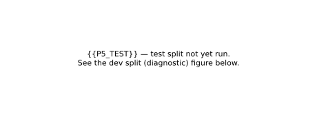
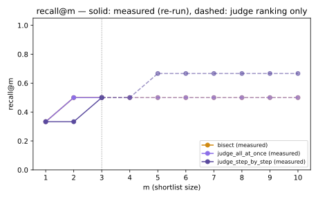
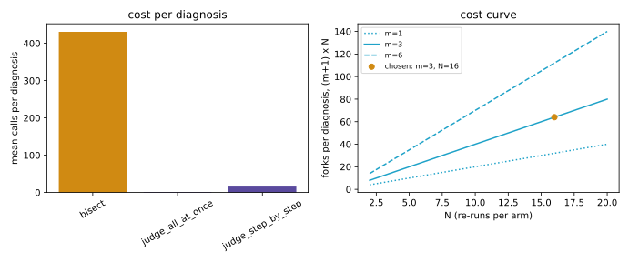

# Bisect — report

Every table between a `<!-- BEGIN table:NAME -->` / `<!-- END table:NAME -->`
pair is generated by `uv run python scripts/report/render.py` from committed
inputs under `data/` — never hand-edited. `make reproduce` regenerates every
table and figure here and fails if anything differs from what is committed.
See [Reproduce](#reproduce) at the bottom for the exact commands.

**Status of this document: STAGE A.** P5's TEST split (12 items) is running
live as this is written. Every number that depends on it is marked
`{{P5_TEST}}` and will be filled in automatically the next time
`scripts/report/render.py` runs after `data/results/p5_summary.json` and
`data/results/p5_items.json` are overwritten with the test-split results —
no prose needs editing by hand. Numbers that do not depend on the test split
(P0–P4, P7, the dataset construction, the dev split) are final and real.

## Summary

Bisect rewinds a failed agent run to a step, changes exactly one thing,
re-runs the rest of the run *N* times under a treated arm (the fix) and a
control arm (as recorded), and reports the step's causal effect on pass rate
with a 95% confidence interval. The question this report answers: on
τ²-bench failures with a known planted cause, does testing each suspect step
this way find the right step more often than asking an LLM judge to read the
transcript and guess — and at what cost?

**What the data can say, and what it cannot, stated before the headline
number:**

- The P5 gate — Bisect step accuracy ≥ best judge + 15 points, with the 95%
  paired-bootstrap CI of the gap entirely above 0 — is pre-registered
  ([`0001`](decisions/0001-preregistration.md)) and evaluated on the frozen
  **test split**. A power calculation run *before* any live P5 call
  ([`docs/findings/p5-power.md`](findings/p5-power.md), reproduced in
  [table:power_mde](#power-and-minimum-detectable-effect) below) found that
  at this dataset's size — a consequence of the P3 collection coming in
  under its own floor (see [Dataset card](#dataset-card)) — the gate has
  **9–14% power to detect the pre-registered 15-point effect at all**. A FAIL
  is the expected outcome whether or not a 15-point gap exists; only a PASS,
  which implies an effect of roughly 40+ points, is informative at this n.
  The verdict is reported below exactly as it fell, with this context beside
  it, per the pre-registration's rule that a gate is never softened after
  results are seen.
- **Accuracy decomposes as recall@m × conditional accuracy.** Bisect can
  only find the step the judge shortlisted (`m = 3`); on the dev split it
  was exact on every item the judge's shortlist contained and blamed nothing
  on the rest, so accuracy (0.500) is exactly judge recall@3 (0.50) times
  conditional accuracy given a hit (1.00). Whether this decomposition holds
  on the test split is one of the things this report exists to show.
- **The P3 dataset's headline finding is not the test-split accuracy at
  all**: 292 real, consequential mutations of a real tool result produced
  only 18 items that flipped a run 3-or-4 times in 4 — a **6.2% keep rate**.
  The agent re-reads, re-queries, and usually recovers from a single planted
  perception fault. That is a finding about agent robustness, reported in
  full in [Dataset card](#dataset-card), and it is the honest reason the
  dataset is smaller than its pre-registered target.
- **A robustness finding, measured on the P3 stability and faulted re-runs**:
  `docs/decisions/0017-p3-collection-policy.md` §5 reports the observed
  variation of independent re-runs under provider non-determinism at
  temperature 0 — every P5 interval assumes those re-runs vary for real
  reasons, not by construction, and that assumption is checked, not
  presumed (see [Cost](#cost) and [Deviations](#deviations-from-the-pre-registration)).

## Method

```
effect(k) = P(pass | fix step k) − P(pass | step k as recorded)
```

1. **Record.** Every step of a run — the exact model request, the tool call
   and a snapshot of the world before and after — is written to an
   append-only tape. Replay from the tape is byte-identical and makes zero
   network calls; a request-hash mismatch on replay is a hard error
   (`DivergenceError`), never a silent live fallback.
2. **Shortlist.** An LLM judge reads the failed transcript and proposes up
   to `m = 3` suspect steps, in two protocols reported side by side:
   all-at-once (one call, ranks every step at once) and step-by-step (asks
   about each step in turn, stops at the first "yes").
3. **Rewind and intervene.** For each suspect step *k*, the world is
   restored to `state_before` of *k* — hash-checked against the tape — and
   exactly one intervention is applied: a tool-result fix, a forced action,
   a fresh sample, an edited prompt, or a swapped model.
4. **Treated vs. control, *N* times each.** The **treated** arm re-runs the
   rest of the trajectory live with the fix applied; the **control** arm
   re-runs it live exactly as recorded, from a single shared fork at the
   earliest tested step (`docs/decisions/0005-shared-control.md`). Wilson
   score intervals per arm, Newcombe's method 10 for the 95% CI on the
   difference.
5. **Blame.** The **earliest** step whose CI lower bound clears
   `δ = 0.10` — not the largest effect, because a later, partially-recovering
   fix should not mask the true cause. Interim looks (batches of 4, up to
   `N = 16`) use an O'Brien–Fleming efficacy boundary
   (`docs/decisions/0008-sequential-efficacy-boundary.md`); the *reported*
   interval stays the nominal 95% Newcombe CI at whatever *N* the procedure
   stopped at.

**Shared control, and its boundary condition.** One control arm is drawn,
forked at the earliest tested suspect, and reused for every candidate step —
this assumes the recorded failure is reproducible from any fork point at or
after it. That assumption fails for a *one-shot* fault (a single edited
recording): a fork taken before the fault runs live and never sees it, so
the control silently measures the base run instead of the failure
(`docs/findings/p5-control-fork.md`). The dataset therefore plants faults as
a **standing faulty tool** — a world component that corrupts one call's
*returned message*, every time it executes, leaving the database untouched
(`docs/decisions/0016-persistent-planted-fault.md`) — which restores the
shared-control assumption without deviating from the pre-registered N=4,
δ=0.10, or the earliest-step rule. `control_reproduces_failure` is computed
and reported per item as a diagnostic (never a filter).

**Interventions used:** `ReplaceToolResult` (tool return value — planted
faults and repair proposals), `ForceAction`, `Resample`, `EditPrompt`
(system prompt from *k* onward — used by the PR check), `SwapModel`. Suspect
steps get the intervention appropriate to their step type: `Resample` for an
agent/user turn, `TruthfulToolResult` (re-executed on a clean environment of
its own) for a tool step (`docs/decisions/0013-suspect-interventions.md`).

**The OBF boundary (a deviation from the letter of the pre-registration,
recorded before any live data existed).** Acting on a nominal 95% bound at
up to four successive looks is not a 95% test, and the earliest-step rule
makes a false crossing at an early null step irreversible. P4 measured this
directly: sequential testing turned 0 false blames into 11 out of 200 synthetic
runs. The O'Brien–Fleming boundary is *stricter*, not more permissive — see
[P4 synthetic validation](#p4-synthetic-validation).

## Dataset card

**Construction** (`bench/inject.py`, `docs/brief/summary.md` §3):

1. Record a success (τ² airline or retail task, reward = 1.0).
2. Stability check: re-run 4× fresh (not forked — a fork replays nothing
   before the fault, so it *is* a fresh recording); keep if pass rate ≥ 0.75.
3. Pick a tool-result step *k*, stratified early/middle/late.
4. Plant one of four fault types: `wrong_value`, `missing_field`,
   `stale_record`, `tool_error` — a standing `FaultInjector` that corrupts
   that one call's returned message every time it fires, leaving the
   database untouched.
5. Re-run the rest, N = 4, with the fault standing.
6. Keep iff faulted pass rate ≤ 0.25. Label = *k*; oracle fix = the original
   tool result.

**The funnel, strata and manifest sizes:**

<!-- BEGIN table:funnel -->
| Stage | Count |
|---|---|
| base runs attempted | 173 |
| stable (>= 0.75 over 4 re-runs) | 57 |
| unstable | 16 |
| candidates tried | 167 |
| candidates: not flipped (faulted pass > 0.25) | 149 |
| candidates: repeated call before k (rejected) | 7 |
| candidates: infrastructure-lost | 118 |
| kept (faulted pass <= 0.25 at N=4) | 18 |

**Manifest sizes**

| Manifest | Items | Dev | Test |
|---|---|---|---|
| strict (primary; P3 gate evaluated on this) | 18 | 6 | 12 |
| extended (secondary; faulted pass <= 0.50, post hoc) | 26 | 9 | 17 |
| flaky world (unsplit; bounded, infra-limited attempt) | 3 | — | — |

**Strata (strict manifest)**

| Domain / fault type | Position | n |
|---|---|---|
| airline / missing_field | middle | 1 |
| airline / stale_record | early | 1 |
| airline / tool_error | early | 1 |
| airline / tool_error | late | 1 |
| airline / tool_error | middle | 2 |
| retail / missing_field | early | 1 |
| retail / missing_field | middle | 1 |
| retail / stale_record | early | 1 |
| retail / stale_record | middle | 1 |
| retail / tool_error | early | 4 |
| retail / tool_error | middle | 1 |
| retail / wrong_value | early | 3 |
<!-- END table:funnel -->

**Task grouping and the split.** The dev:test split is 1:2, grouped by τ²
*task* (not by item — two items from the same task share a world and a
policy, so splitting them would leak test data into dev), and stratified by
domain × fault type × position where the ratio allows. The manifest hash is
committed before any P5 tuning: `data/manifest.sha256`.

**The standing-fault decision (0016).** A one-shot edited recording breaks
the shared-control assumption (see [Method](#method)); every fault in this
dataset is a standing faulty tool instead, so a fork taken anywhere at or
after the fault still reproduces the original failure. This is the one
change to the pre-registered dataset construction, decided before any P3
collection or P5 evaluation was spent.

**Why the dataset is 18 items against a 120-item target (60-item fallback
floor).** `docs/decisions/0012-p3-floor.md` triggered the 60-item fallback
floor *before* any P3 data existed, from a bottom-up cost re-projection
(P0's own 5.9–8.8h estimate omitted the four-fold stability re-run). Even
so, collection reached only 18: **292 candidates → 18 kept, a 6.2% keep
rate**, at **3,738 calls per kept item**. `docs/decisions/0021-p3-outcome.md`
records the decision to freeze at that count rather than spend a further
52–121 hours the task pool could not supply (158 of 164 tasks were already
exhausted). The headline finding this leaves behind: **a single planted
perception fault rarely flips this agent** — it re-reads, re-queries and
usually recovers. Kept items are, by construction, the consequential faults;
accuracy measured on them is accuracy *on faults that matter*, not evidence
about how often real agent failures look like these
(`docs/decisions/0017-p3-collection-policy.md` §7.4).

**Secondary set.** `data/manifest_extended.json` adds items whose faulted
pass rate was ≤ 0.50 (a weaker but real causal effect), chosen *after*
seeing the data and therefore never eligible to gate anything
(`docs/decisions/0021-p3-outcome.md`).

**Flaky-world set.** `data/manifest_flaky.json` froze at 3 items after a
bounded, two-hour, infrastructure-limited attempt (69 timeouts, 49 gateway
504s against 1 rate-limit signal) — stopped by a provider that would not
answer, not by the protocol. Three items cannot support an interval on a
difference; see [Flaky world](#flaky-world).

**Task grouping by domain, licence, and how to load:** airline (pure-code
reward: DB hash, actions, communicate checks) and retail (112 of 114 tasks
carry an LLM-judged natural-language-assertion reward, routed to the P0
judge model rather than τ²'s own default —
`docs/decisions/0018-retail-nl-judge.md` — so retail rewards here are **not**
bit-comparable with a published τ²-bench number). MIT licence, same as the
rest of the repository. Load with:

```python
from agent_bisect.bench.manifest import load_frozen
manifest = load_frozen()          # data/manifest.json, hash-checked
test_items = manifest.split("test")
```

**Limitations of this dataset**, stated plainly:

- Small *n* (18 strict items; 12 in the test split), which is why the power
  analysis above governs how the headline result should be read.
- Faults are **injected**, not organic — a mechanically mutated tool result,
  not a naturally occurring agent mistake. The construction is structurally
  close to Who&When Pro's synthetic-injection recipe
  (`docs/findings/landscape.md`, 2026-09-17 P0→P1 entry); it measures
  *localization of an injected error*, not attribution of an organic
  failure, and the report does not conflate the two.
- Retail rewards are judged by an LLM (see above), which puts a sampled
  quantity inside the very stability and keep-rate checks that decide
  dataset membership.
- Kept items over-represent faults a real write action depended on
  (dependency-aware targeting, `docs/decisions/0017-p3-collection-policy.md`
  §7.3) — deliberate, and stated as a threat to validity, not hidden.

## Results

**Primary comparison, test split** (pending — `{{P5_TEST}}`):

<!-- BEGIN table:accuracy -->
_{{P5_TEST}} — test split not yet run. No test-split summary yet. Re-run `make reproduce` once P5 STAGE B lands to fill this table in._
<!-- END table:accuracy -->

<!-- BEGIN table:gap -->
_{{P5_TEST}} — test split not yet run. No test-split summary yet. Re-run `make reproduce` once P5 STAGE B lands to fill this table in._
<!-- END table:gap -->

### Power and minimum detectable effect

<!-- BEGIN table:power_mde -->
| True gap | Power (judge base 0.10) | Power (0.25) | Power (0.40) |
|---|---|---|---|
| +15 pts | 0.14 | 0.12 | 0.09 |
| +25 pts | 0.40 | 0.37 | 0.37 |
| +40 pts | 0.82 | 0.79 | 0.76 |
| +55 pts | 0.95 | 0.95 | 0.96 |

_Strict test split: n=12 items, 10 task clusters. The smallest observed result that clears the gate's CI is the smallest observed result that clears the CI: Bisect right on 4 of 12 items where the judge is right on none (CI [+0.077, +0.636]). Source: `docs/findings/p5-power.md`, reproduce with `uv run python scripts/p5_power.py`._
<!-- END table:power_mde -->

### Accuracy by position and fault type (test split)

<!-- BEGIN table:by_position -->
_{{P5_TEST}} — test split not yet run. No test-split summary yet. Re-run `make reproduce` once P5 STAGE B lands to fill this table in._
<!-- END table:by_position -->

<!-- BEGIN table:by_fault_type -->
_{{P5_TEST}} — test split not yet run. No test-split summary yet. Re-run `make reproduce` once P5 STAGE B lands to fill this table in._
<!-- END table:by_fault_type -->

### recall@m and cost




### Per-item detail (test split)

<!-- BEGIN table:per_item -->
_{{P5_TEST}} — test split not yet run. No test-split items yet. Re-run `make reproduce` once P5 STAGE B lands to fill this table in._
<!-- END table:per_item -->

### dev split (diagnostic, not a gate)

Nothing above this subsection was tuned on the dev split — it exists to find
bugs and to answer the diagnostic questions `docs/decisions/0016` posed
before any test-split data existed
(`docs/decisions/0014-p5-freeze.md`). These numbers are reported honestly
because hiding the split you developed on is how a benchmark stops being
one; they gate nothing.

<!-- BEGIN table:accuracy_dev -->
| Method | n | Accuracy | 95% Wilson CI | Mean calls | Mean re-runs |
|---|---|---|---|---|---|
| Bisect | 6 | 0.500 | [0.188, 0.812] | 430.8 | 59.3 |
| Judge, all-at-once | 6 | 0.333 | [0.097, 0.700] | 1.2 | 0.0 |
| Judge, step-by-step | 6 | 0.167 | [0.030, 0.564] | 15.8 | 0.0 |
<!-- END table:accuracy_dev -->

<!-- BEGIN table:gap_dev -->
| Comparator | Gap (points) | 95% paired-bootstrap CI | CI entirely above 0 | Clears the +15pt bar | Resamples |
|---|---|---|---|---|---|
| Judge, all-at-once | +16.7 pts | [+0.0, +60.0] pts | no | yes | 10000 |
<!-- END table:gap_dev -->

**Diagnostics from the dev split** (`docs/decisions/0014-p5-freeze.md`):
`control_reproduces_failure` flagged on **0 of 6** items (control-arm pass
rates 0.00, 0.00, 0.00, 0.00, 0.10, 0.00 — the standing fault reproduces the
recorded failure from any fork point, as `0016` requires); **0** responses
served past the request-hash guard; **0** parse failures; **0** unevaluated
items. Bisect was exact on every item the judge's top-3 shortlist contained
(3 of 3) and blamed nothing on the rest (3 of 3) — accuracy (0.500) is
exactly judge recall@3 (0.50) times conditional accuracy given a hit (1.00).

<!-- BEGIN table:by_position_dev -->
| Method | Position | n | Accuracy |
|---|---|---|---|
| Bisect | early | 4 | 0.500 |
| Judge, all-at-once | early | 4 | 0.250 |
| Judge, step-by-step | early | 4 | 0.250 |
| Bisect | middle | 2 | 0.500 |
| Judge, all-at-once | middle | 2 | 0.500 |
| Judge, step-by-step | middle | 2 | 0.000 |
<!-- END table:by_position_dev -->

<!-- BEGIN table:by_fault_type_dev -->
| Method | Fault type | n | Accuracy |
|---|---|---|---|
| Bisect | stale_record | 1 | 0.000 |
| Judge, all-at-once | stale_record | 1 | 0.000 |
| Judge, step-by-step | stale_record | 1 | 0.000 |
| Bisect | tool_error | 4 | 0.750 |
| Judge, all-at-once | tool_error | 4 | 0.500 |
| Judge, step-by-step | tool_error | 4 | 0.250 |
| Bisect | wrong_value | 1 | 0.000 |
| Judge, all-at-once | wrong_value | 1 | 0.000 |
| Judge, step-by-step | wrong_value | 1 | 0.000 |
<!-- END table:by_fault_type_dev -->





<!-- BEGIN table:per_item_dev -->
| Item | Domain | Fault | Position | Planted step | Bisect (predicted / verdict) | Judge, all-at-once (predicted / verdict) | Judge, step-by-step (predicted / verdict) |
|---|---|---|---|---|---|---|---|
| airline-17-k4-tool_error | airline | tool_error | early | 4 | 4 / exact (shortlisted) | 5 / later (shortlisted) | 4 / exact (shortlisted) |
| airline-30-k8-tool_error | airline | tool_error | middle | 8 | none / none (not shortlisted) | 25 / later (not shortlisted) | 13 / later (shortlisted) |
| retail-106-k8-wrong_value | retail | wrong_value | early | 8 | none / none (not shortlisted) | 21 / later (not shortlisted) | 15 / later (not shortlisted) |
| retail-17-k10-tool_error | retail | tool_error | middle | 10 | 10 / exact (shortlisted) | 10 / exact (shortlisted) | 13 / later (not shortlisted) |
| retail-17-k4-tool_error | retail | tool_error | early | 4 | 4 / exact (shortlisted) | 4 / exact (shortlisted) | none / none (shortlisted) |
| retail-29-k8-stale_record | retail | stale_record | early | 8 | none / none (not shortlisted) | 15 / later (not shortlisted) | none / none (not shortlisted) |
<!-- END table:per_item_dev -->

## P4 synthetic validation

Before any real recording existed, the estimator was proven on 200
synthetic runs with a known planted causal step and Bernoulli-fake replay
(zero network calls, deterministic from a fixed master seed):

<!-- BEGIN table:p4 -->
| Criterion | Requirement | Measured | Result |
|---|---|---|---|
| planted step found | >= 0.95 | 0.8950 | FAIL |
| coverage (fixed N=16) | in [0.92, 0.98] | 0.9671 | PASS |

| Measure | Value | 95% CI |
|---|---|---|
| planted step found | 179/200 = 0.8950 | [0.8448, 0.9303] |
| outcome breakdown | earlier 0 · later 0 · none 21 | — |

**Power at N=16 per arm, delta=0.1 (exact enumeration, nominal 95% look)**

| control \ treated | 0.60 | 0.70 | 0.80 | 0.90 |
|---|---|---|---|---|
| 0.00 | 0.981 | 0.998 | 1.000 | 1.000 |
| 0.10 | 0.717 | 0.881 | 0.968 | 0.997 |
| 0.15 | 0.552 | 0.761 | 0.915 | 0.988 |

_Source: `docs/gates/P4.md, docs/findings/p4.md`, reproduce with `uv run python scripts/gates/p4.py --power-table`._
<!-- END table:p4 -->

**Reading it honestly.** The pre-registered bar (found ≥ 0.95) FAILED at
0.895, confirmed on a second, pre-declared seed at 0.930. The shortfall
splits into two separable, measured costs: **peeking** under repeated
testing (≈3 points, entirely removed by the OBF boundary — false blames
went from 11/200 to 0/200, at a net accuracy cost of only 0.005, because
most of the rescued runs simply became non-detections instead) and a
**structural power ceiling** at N = 16 per arm (≈8 points — the power table
above shows a real 0.45-point effect is detected barely half the time at
N=16). No threshold, δ, N, generative parameter or seed was changed after
seeing a result; one of three permitted fix attempts was used, and it
targeted a real statistical defect (found in the peeking analysis) rather
than the ceiling, which cannot be fixed by the estimator.
`docs/decisions/0020-user-acceptance-p4-p6.md` records the owner's post-hoc
acceptance under a relaxed bar (found ≥ 0.85 **and** wrong-step blames
≤ 0.02): **PASS at 0.895/0.000** under that bar, **FAIL** under the
pre-registered one — both are reported, never just the one that passes.

**Consequence for P5:** Bisect proper tests a judge shortlist of `m = 3`
steps, not the ~19 steps per run P4's synthetic model tested — roughly a
fourfold reduction in false-early-blame exposure, so P5's accuracy on the
same estimator is expected to be *better* than 0.895, not worse, provided
judge recall@m holds (`docs/findings/p4.md`).

## Flaky world

The claim snapshots exist to support is correctness under non-determinism,
not speed: plain τ² tools are deterministic (`_get_new_reservation_id`
draws from a fixed list, `_get_datetime` returns a constant), so on the
plain-world dataset snapshot and re-run-live agree **by construction**
(`docs/decisions/0011-flaky-world.md`) — that equality is asserted from the
tools' determinism, not measured, per
`docs/decisions/0022-p5-scope.md` (re-run-live was dropped from the plain
world entirely once the cost of confirming a tautology twice a full split's
wall-clock was measured against its one load-bearing use disappearing —
see below).

**This is not measured as a live comparison, and the report says so rather
than computing a number from an underpowered sample.** The flaky-world
manifest — the environment engineered specifically to make snapshot and
re-run-live disagree — froze at **3 items** after a bounded, two-hour
collection that lost 69 requests to timeouts and 49 to gateway 504s, not to
the protocol or the flaky world itself
(`docs/decisions/0021-p3-outcome.md`). Three items cannot support an
interval on a difference, which is what the pre-registered criterion ("the
no-snapshot baseline is measurably worse, CI of the difference above 0")
needs. **The honest statement is that the ablation was not collected, not
that it was collected and came out small.**

What *is* shown, deterministically and offline, is the mechanism the
ablation exists to demonstrate:

<!-- BEGIN table:flaky_mechanism -->
| Arm | What it does | DB-hash reproduction rate |
|---|---|---|
| snapshot | restore the recorded world state at a step; never re-executes the tool | 100% |
| rerun_live | re-execute the same tool calls against a live, flaky environment | 0% |

_Measured over 10 recorded runs and 30 tool steps, offline and deterministically (`tests/test_tau2_flaky.py`). The flaky-world engine mechanism, measured offline and deterministically (no provider call, no seed dependence). It is evidence for the ablation the P5 gate's flaky-world criterion asks for, not a substitute for it: data/manifest_flaky.json froze at 3 items after a bounded, infrastructure-limited collection, too few to support an interval on a difference (docs/decisions/0021-p3-outcome.md, docs/decisions/0022-p5-scope.md)._
<!-- END table:flaky_mechanism -->

A snapshot restore reproduces the recorded database state exactly, every
time, because it never touches the live (flaky) tool again. Re-executing the
same calls later reproduces it never, because the flaky world's random
identifiers, drifting clock-dependent reads and injected transient errors
make every live re-execution a different world. This is a property of the
engine, proven without a provider and without a seed, and it is not a
substitute for the live ablation the pre-registered gate asks for — the P5
gate's flaky criterion is reported as **not decidable at n = 3**, below.

## PR check

`agent_bisect/gate/` runs a fixed scenario suite on `base` and `head`,
flags a regression when the pooled pass-rate drop is both statistically
significant (95% Newcombe interval of `head - base` entirely below 0) and
at least 10 percentage points, then blames the decisive step on every *new*
failure and posts one PR comment
(`docs/decisions/0019-gate-rule.md`). P7's gate:

- **Local layer** (8 scripted scenarios, tau2's mock domain, 4 seeded runs
  each): 3/3 planted regressions flagged with the correct step named, 0/3
  false alarms on no-op PRs.
- **Real layer**, on real PRs against the public repository: 3/3 regressions
  correctly flagged and failed the check; 3/3 no-ops correctly passed.

```
Bisect · agent regression detected
scenario suite     airline-refunds (24 tasks × 4 runs)
pass rate          base 0.83  →  head 0.54   (p = 0.002)
decisive step      step 7 · agent → get_reservation_details
effect of reverting at step 7   +0.62  95% CI [0.38, 0.81] · N = 12
what changed at step 7
  - asks for the reservation ID before looking anything up
  + looks up the most recent reservation by user_id
  caused by: system_prompt.md L31–L36 (this PR)
7 of 13 new failures share this step · 212 model calls · details → bisect serve
```

Full evidence, including the real PR links: [`docs/gates/P7.md`](gates/P7.md).

## Cost

<!-- BEGIN table:calls_by_phase -->
| Phase | Calls |
|---|---|
| P0 | 2932 |
| P1 | 632 |
| P3 | 72294 |
| P5 | 13463 |
| P5-smoke | 9 |
| **total** | **89330** |
<!-- END table:calls_by_phase -->

_Snapshot from `runs/ledger.sqlite` via `scripts/report/ledger_by_phase.py`,
committed as `data/results/ledger_by_phase.json`; regenerated only when
asked, so this table can lag a still-running phase (P5's test split is live
as this document is written) — re-run the script before the final
publication pass._

**Where the calls go, per method.** The realistic per-item cost is
`(m + 1) x N` forks (a judge call, plus `m` treated arms and one shared
control, each re-run `N` times) minus the forks a futility stop saves — which
`docs/findings/p5-cost.md` shows is close to none at `δ = 0.10`: a perfectly
innocent step's Wilson upper bound at N=16 is 0.194, still above δ, so
futility essentially never fires; a perfect step blames at look 2, not look
1, because look 1's OBF boundary (nominal confidence 0.99995) is stricter
than 4/4 vs. 0/16 can clear. Levers taken to fit the budget, none of which
touch a gated parameter: `no_control` is **derived** from Bisect's own
treated draws rather than bought live (0 extra calls); `rerun_live` runs
only where it is load-bearing — the flaky world — not on the plain world,
where it would confirm a tautology
(`docs/decisions/0018-p5-budget.md`, `0022-p5-scope.md`).

## Failure cases

`{{P5_TEST}}` — filled in once the test split's per-item table above exists.
Read alongside it: every item where Bisect's verdict is `none` (the judge's
shortlist did not contain the planted step — a recall miss, not an
estimator failure) or a wrong step (`earlier`/`later` — the estimator tested
the right step and still missed, or a different step cleared δ first). The
dev split's only miss pattern was `none` (see the dev subsection above);
whether the test split repeats that shape is exactly what this table will
show.

## Deviations from the pre-registration

Every deviation from `docs/decisions/0001-preregistration.md`, dated, with
the decision that recorded it — each one fixed **before** the data it
affects was seen, per that document's own rule that no threshold is changed
after results are known.

| Date | Deviation | Decision |
|---|---|---|
| 2026-09-17 | O'Brien–Fleming efficacy boundary replaces the uncorrected repeated-look rule for interim blame decisions (P4's peeking defect) | [`0008`](decisions/0008-sequential-efficacy-boundary.md) |
| 2026-09-17 | P5's primary configuration fixed as OBF + the pre-registered parameters, with the uncorrected rule kept as a sensitivity | [`0009`](decisions/0009-p4-outcome-and-p5-primary.md) |
| 2026-09-17 | Flaky-world reward computed via canonicalised DB-hash comparison (τ²'s evaluator cannot score a flaky run's random identifiers) | [`0011`](decisions/0011-flaky-world.md) |
| 2026-09-17 | P3 gate evaluated against the pre-registered 60-item fallback floor, not the 120-item target, triggered *before* any P3 data existed | [`0012`](decisions/0012-p3-floor.md) |
| 2026-09-17 | Retail's NL-assertion judge routed to the P0-chosen model (τ²'s default 404s on this account); retail band moved to last in collection order | [`0018-retail-nl-judge`](decisions/0018-retail-nl-judge.md) |
| 2026-09-17 | Planted faults are a **standing faulty tool**, not a one-shot edited recording, so the pre-registered shared control remains valid | [`0016`](decisions/0016-persistent-planted-fault.md) |
| 2026-09-17 | P3 collection order, per-run attempt caps, stop rule and the flaky-world collection plan, fixed before any collection ran | [`0017`](decisions/0017-p3-collection-policy.md) |
| 2026-09-17 | P5 budget: `no_control` derived rather than bought live; `rerun_live` scoped to dev (plain world) + full (flaky world); per-step control as a dev-only sensitivity; recall@m beyond 3 reported as judge-ranking-only | [`0018-p5-budget`](decisions/0018-p5-budget.md) |
| 2026-09-17 | P7's PR-check demo uses `SequentialConfig(batch=8, max_n=8, efficacy_boundary="none")`, not P5's OBF primary — a scoped deviation for `gate/` alone, justified by the demo's scripted, cost-free re-runs | [`0019`](decisions/0019-gate-rule.md) |
| 2026-09-17 17:55 | Owner accepted P4 under a relaxed bar (found ≥ 0.85, wrong-step blames ≤ 0.02) and P6 as shipped, post hoc; pre-registered bars and measured numbers stay reported alongside | [`0020`](decisions/0020-user-acceptance-p4-p6.md) |
| 2026-09-18 | P3 frozen at 18 items (below the 60 floor); an extended, post-hoc secondary manifest added; flaky-world collection bounded to 2 hours | [`0021`](decisions/0021-p3-outcome.md) |
| 2026-09-20 | `rerun_live` dropped from the plain world entirely (dev included) — its one load-bearing use, the flaky ablation, no longer exists at a supportable n | [`0022`](decisions/0022-p5-scope.md) |

**Also recorded, not gate-relevant but part of the honest record:**

- P1's measured airline pass rate (0.85, 17/20) differs from P0's probe
  (0.60, 12/20) on the same tasks and models — provider non-determinism at
  temperature 0, not a seed effect (τ²'s seed is a no-op for the LLM agent
  and user simulator); the P0 model choice was not revisited
  (`docs/decisions/0015-p1-pass-rate-vs-p0.md`).
- **A security incident**: an early recording path leaked `.env` into two
  config tests, found by `p1a-record-core` and forwarded to `p0b-measure`
  before any live call was made with the affected code; the redaction gate
  (`docs/gates/P1.md`) subsequently found the key in no blob or log.
- **Three silent stalls, ~16h, ~26h and one shorter one, all caused by an
  agent or supervisor treating a non-terminal state as done** and not
  reporting it — recorded in full in `docs/LOOP_STATE.md`'s history, with
  the lesson (agents waiting on background monitors are a silent-failure
  mode) applied as a standing safeguard (an hourly self-check).

## Design lessons

- **Gate bars set without a power calculation fail for a reason that has
  nothing to do with the method.** Both P4 (0.95 found-rate bar at N=16,
  ceiling ≈0.92) and P5 (+15-point gap bar on an 18-item dataset, 9–14%
  power) hit exactly this — the bar and the sample size were each fixed
  independently in the pre-registration, and nobody multiplied them
  together before spending the budget. The fix (`docs/findings/p5-power.md`
  recommends) is not to weaken bars after the fact, which the pre-registration
  correctly forbids; it is to compute the power table *before* fixing the
  bar and the *n* together, in the open.
- **A monitor that never fires is a silent-failure mode**, not a passive
  safety net. Every stall recorded in [Deviations](#deviations-from-the-pre-registration)
  above involved an agent or a supervisor sitting on a background wait that
  had already resolved into a terminal state (a spent budget, a crashed
  process) without anyone being told. The standing fix is an orchestrator
  that polls long jobs itself on a fixed interval rather than trusting a
  push notification that assumes the pushing side is still alive.
- **A shared control is only valid if the failure it controls for persists
  past the fork point.** `docs/findings/p5-control-fork.md` found this
  offline, before any live spend, by literally forking a control before a
  one-shot planted fault and watching it pass. The general lesson: any
  causal-replay design with a reused control arm needs an explicit,
  checked assumption ("the control reproduces the failure"), not an
  implicit one.
- **A reasoning model's judge output can silently exceed its own
  chain-of-thought budget.** One of the bugs found on the dev split (item 1
  of `docs/decisions/0014-p5-freeze.md`) was the judge's output cap sitting
  below the tokens its own reasoning consumed, so every item would have
  scored as a parse failure — caught only because dev tuning exists to find
  exactly this before it costs a test-split call.
- **Per-model rate limits, discovered rather than assumed, both protect and
  under-use the budget.** P0 *bracketed* each model's ceiling instead of
  finding it; P3's `core.rate_edge` (`docs/decisions/0017-p3-collection-policy.md`
  §8) walks the discovered ceiling up on clean windows and down on 429
  storms, which is what let collection actually use the capacity available
  rather than sit at a conservative guess.
- **P0's measured airline pass-rate gap versus P1's live recordings** (0.60
  vs 0.85 on the same 20 tasks) is a reminder that "temperature 0" does not
  mean deterministic on a hosted provider — every downstream interval in
  this report assumes that same non-determinism is what makes re-run
  variation real (see [Deviations](#deviations-from-the-pre-registration)).

## Prior art

Full dated entries: [`docs/findings/landscape.md`](findings/landscape.md).
Credited in the README and here: **causal-agent-replay (CAR)**,
**DoVer**, **Who&When** (and **Who&When Pro**), **TraceElephant**,
**CausalFlow**, **AgenTracer**.

| Project | Snapshots | Replay | Causal stats | Benchmark | PR check | Comparable numbers? |
|---|---|---|---|---|---|---|
| Who&When (ICML 2025) | — | — | — (LLM judge) | ✓ (184 organic failures) | — | **Comparable**: 14.2% step-level, 53.5% agent-level — the standard "an LLM judge alone is bad at this" citation |
| Who&When Pro (Jul 2026) | — | ◐ (warm-started replay) | — (LLM judge) | ✓ (12,326 injected-error runs) | — | **Not comparable**: 73.9% step accuracy is *localizing a synthetically inserted outlier action*, not organic-failure attribution; paired with 22.2% error-mode macro-F1, which the paper itself reads as "finding a step ≠ understanding it" |
| Ma et al., causal-inversion | — | — | ✓ (Shapley) | ✓ (Who&When/TRAIL) | — | **Comparable construct**: 36.2% step-level — the best published organic-failure step-accuracy number found |
| TraceElephant | — | ✓ (full traces) | — | ✓ (220 re-runnable) | — | Not a step-accuracy number to beat; supports the premise that full state access (not just outputs) matters, independently of Bisect's intervention story |
| TrajDebug / TrajErrBench | — | — (log-based only) | ◐ (rule-based origin selection, no CI) | ✓ (τ²-bench + SWE-Bench Pro, 486 organic) | — | Closest *benchmark* overlap (first published τ²-bench attribution work found); not a method overlap — no rewind, no re-execution, no intervention, no CI |
| CAR (causal-agent-replay) | — | ✓ | ✓ (Wilson/bootstrap CIs, do-operator) | — (synthetic SCMs only) | — | Closest *mechanism* overlap: do(step) + repeated re-runs + per-step CIs, same shape as Bisect's estimator; validated on synthetic causal models only, no CLI/dashboard product, not evaluated on τ²-bench |
| AgenTracer | — | ◐ (LLM re-simulation) | ◐ | ✓ (trains a judge model) | — | Counterfactual replay + fault injection to manufacture *training data* for an 8B attributor, not a live per-run statistical estimate with a CI-based blame rule |
| DoVer (Microsoft) | ✓ | ✓ | — | ✓ | — | Optimizes for *fixing* the run (18–28% of failed trials flipped to success), a different metric than a calibrated per-step effect |
| agentoptics/rewind | ◐ | ✓ | — | — | ✓ | Closest *product-shape* overlap (CLI + fork/replay + GitHub Action); deterministic + LLM-opinion, no statistical N-run treated/control, no CI |
| **Bisect** | ✓ | ✓ | ✓ (Newcombe CI, δ-threshold, earliest-step rule) | ✓ (τ²-bench, planted faults) | ✓ | plus the flaky-world ablation and a shipped dashboard |

**A methodological note, not a competitor**: Mahale (2026,
arXiv:2609.06445) argues naive per-step estimators can make a causally
inert step indistinguishable from a decisive one, and proposes
common-random-numbers (CRN) coupling across the treated and control
rollouts to isolate a step's own contribution — no working system, no
benchmark. Bisect's treated and control arms currently sample
independently (`docs/decisions/0017-p3-collection-policy.md` §5 measures
and reports that variation rather than assuming it away); CRN-coupled
sampling is a candidate refinement for future work, not something this
report claims.

## Reproduce

```bash
git clone https://github.com/kidus-der/agent-bisect
cd agent-bisect
make setup
make reproduce          # regenerates every table and figure here, offline,
                         # byte-compared against what is committed
```

`make reproduce` runs `uv run python scripts/report/render.py` — which reads
only the committed JSON under `data/` (manifests, `p5_summary.json`,
`p5_items.json`, `p4_gate.json` and the small sidecars in
`data/results/`) and never touches `runs/` or the network — under a blocked
socket, then `git diff --exit-code` over every table, figure and this
document. This is the check `scripts/gates/p8.py` runs inside a clean clone,
because it is the part of "reproduce" that is clone-portable: everything it
needs is committed to git.

**`make reproduce-p5` is a separate, machine-local step**, unchanged by P8:
it re-derives `data/results/p5_summary.json` and `p5_items.json` from the
raw per-`(item, method)` outcome table under `runs/p5/`, which is gitignored
(the recorded model transcripts are too large to commit, and readable only
on a machine that ran the live evaluation). Run it, then `make reproduce`,
to check the whole chain end to end on this machine; a fresh clone can only
run the second half, which is exactly what it is committed to prove.
